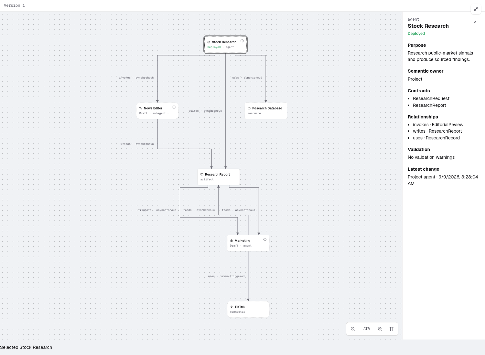

# SAP-3267 ELK with Draft and Deployed indicators

- Source: `6b20faf9a92e5a6b33208daeabc8585ea0f48e39`, including the merged ELK renderer/packing and E8 deployment indicators.
- Actual Studio UI in Chrome on Linux, served by Vite in deterministic mock mode. This is browser evidence; native packaging evidence remains separately documented.
- Screenshot: 1500 × 1100 PNG, expanded vertical Agent Map with the Stock Research inspector open, using the synthetic golden map fixture. No customer data.
- Captured by the existing `agent-map-deployment.spec.ts` mixed-badges test, which passed. It checks matching Draft/Deployed states in map nodes, the rail and inspector; status refresh without graph movement; and no create, resume, bind or input side effects.
- The final renderer is ELK only. No Classic/Vertical selector is present. Resource, artifact and connector nodes have no deployment badge.
- Captured 2026-09-09 UTC. PNG SHA-256: `e39ac91b171a251c6bbeac44ef16c4eb62a8dec0f5bf9650e378ad98a22639e2`.

