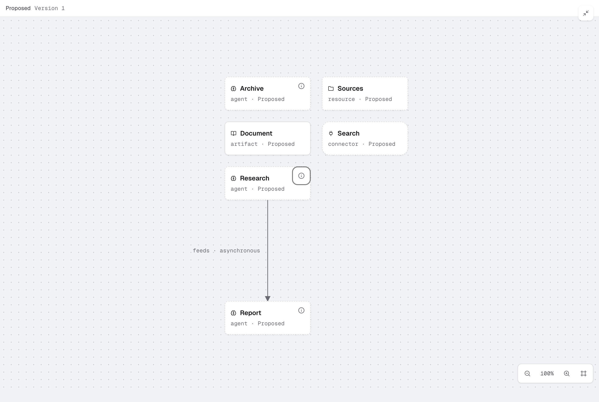

# SAP-3267 Vertical-only packaged desktop proof

- Actual macOS ARM64 Electron app from the normal full DMG/ZIP packaging command; unsigned local verification, no publication.
- Runtime source: e3ef108875677d77b4ee3a00dea3ace051bf9d69, production stack #871 → #874 → #878, based on main 6ab81d92. The follow-up changes only initialization test synchronization.
- Screenshot: 2560 × 1720 PNG; expanded map after packing settled, six synthetic nodes and one asynchronous feed. The only view controls are zoom and Fit; the Classic/Vertical selector is removed.
- Every existing project map uses Vertical ELK. Earlier layout preferences and URL overrides are ignored; there is no Classic rendering or fallback path in project maps. Per-agent Canvas retains its separate layout.
- Actual packaged smoke: 16 passes, one Windows-only skip. Verified local worker loading, old preference/link handling, reload/changing origin, error/retry, live MCP changes, selection, viewport controls, worker teardown and unchanged saved map/history bytes during view operations.
- ELK 0.12.0 worker: 1,595,334 bytes raw / 466,809 bytes gzip. Observed UI readiness: 205 ms cold / 110 ms warm; includes browser/polling overhead.
- Workspace build/typecheck/lint pass. 73 distinct map browser checks pass, including 100-agent chains, fan-out, cycles and disconnected components. The fixture helpers now wait for asynchronous layout before reading rendered nodes.
- Performance (10), desktop (205) and CLI checks pass. The initial full harness run had 3,918 passes, the known macOS watcher failure and an unrelated session-manager timeout. All 183 session-manager tests pass in isolation; see the PR for the final full-suite recheck.

