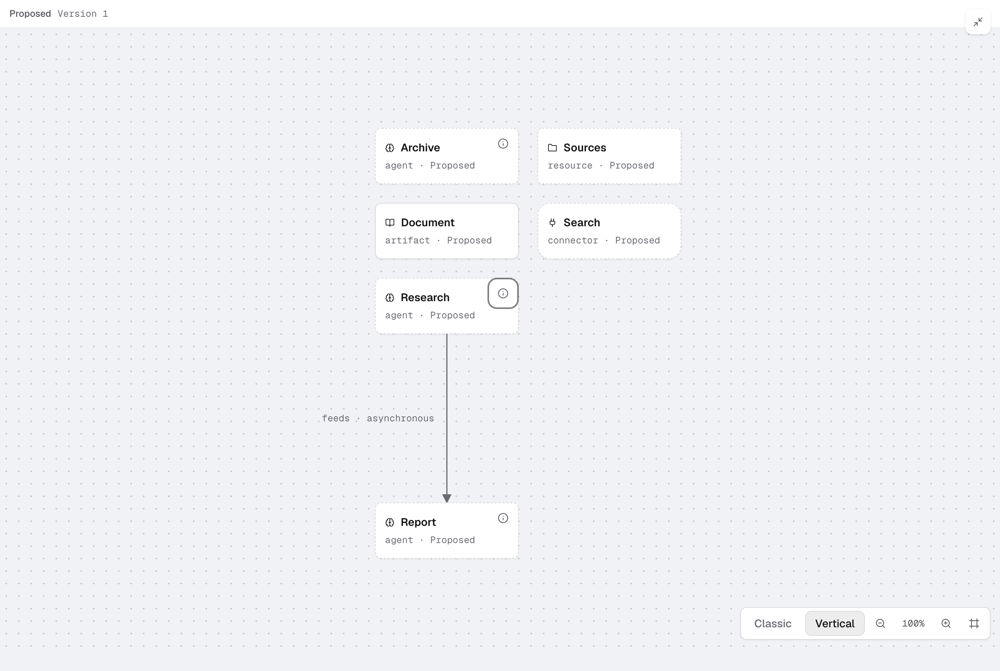

# SAP-3267 packaged desktop proof

- Source: a52ab6e7 (production stack #871 → #874 → #878), based on main 6ab81d92.
- Actual macOS ARM64 Electron 33.4.11 application produced by the normal full DMG/ZIP packaging command; local unsigned verification build, no publication.
- Screenshot: 2560 × 1720 PNG, expanded Agent Map after viewport packing settled. Six synthetic nodes (agents, resource, artifact, connector), one asynchronous feed relationship, same saved revision. First-run help dismissed through the UI.
- ELK 0.12.0, bundled worker: 1,595,334 bytes raw / 466,809 bytes gzip.
- Final packaged smoke: 16 passes; Windows-only agent-shim check skipped.
- Map smoke validates Vertical default, durable Classic across origins, local worker loading, Classic fallback and recovery, selection, pan/zoom/Fit/expanded controls, real MCP map update, worker disposal on navigation, and unchanged map/history bytes during view changes.
- Observed native UI readiness: 307ms cold / 108ms warm. These include browser/polling overhead and are not isolated engine benchmarks.
- Combined candidate: full workspace build/typecheck/lint pass; 36 map browser tests, 10 performance tests and 205 desktop tests pass; CLI checks pass.
- Full Mac harness suite: 3,920 pass, one unchanged workspace-watcher content-edit failure. The same failure reproduces on untouched main 6ab81d92, whose isolated watcher run also fails ignored-directory churn. No Agent Map regression found.

