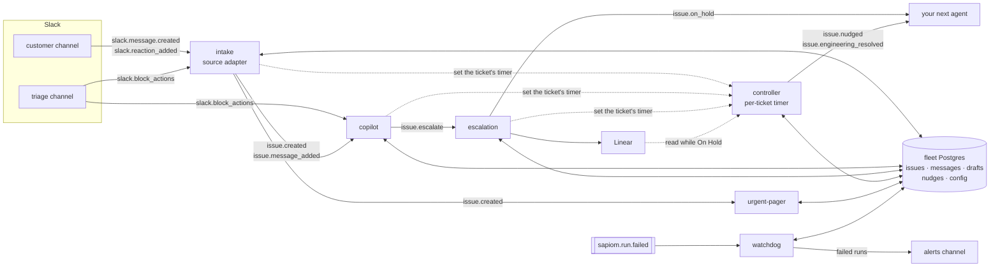

# Support desk

A Slack support desk for B2B teams, installed into your own Sapiom org. Customers write in Slack
channels you share with them; your team works the issues from one triage channel.

- A customer message becomes an **issue**: classified (bug, question, billing, ...; urgent to
  low), linked to the customer's account, and posted as a card in your triage channel.
- A **copilot** drafts a reply from your team's knowledge base and, if you configure one, your
  public docs site. A teammate clicks **Approve** to send it, **Escalate** to open a Linear issue,
  or **Dismiss**.
- A **controller** nudges the triage thread when an issue has no draft, a draft waits for a
  decision, a customer waits for a reply, or nobody owns the issue. It can also page a person.
- An escalated issue comes back to the team when its Linear issue is Done, or when someone clicks
  **Resolved**.
- A **daily digest** lists open issues per desk, and a **watchdog** posts any failed agent run.
- A **Console** web app shows the board, the knowledge base and the settings.

## Install it

You need three things, and no API key:

1. **A Sapiom account.** Sign up at [sapiom.ai](https://sapiom.ai). On the **Connectors** page,
   connect **Slack** and **Linear** (Linear under the MCP relay slug `linear`). In Slack, invite
   the Sapiom bot to your triage channel and to every channel you share with customers.
2. **The Sapiom MCP** in your coding agent. Agent Studio has it built in. In Claude Code:

   ```bash
   claude mcp add sapiom -- npx -y @sapiom/mcp
   ```

3. **This prompt**, pasted into the session:

   ```text
   Install the support desk example from
   https://github.com/sapiom/sapiom-js/tree/main/examples/support-desk into my Sapiom org.
   Clone it, read its README, and follow "Setup (for the coding agent)" step by step, with the
   Sapiom MCP tools. Ask me for my triage channel, on-call person, customer channels and Linear
   team when a step needs them, and show me what each step returned.
   ```

The agent signs you in to Sapiom through the MCP, creates the database, deploys the agents,
attaches their triggers and publishes the Console. It takes about ten minutes.

### What it costs

Each agent run is billed as a run on your Sapiom plan.

| When                                  | Runs                                                                      |
| ------------------------------------- | ------------------------------------------------------------------------- |
| Nothing happens                       | none                                                                      |
| A Slack message the bot can see       | one intake run; when it opens or adds to an issue, one copilot run too    |
| A button click (Slack or Console)     | one intake run and one copilot run (each ignores the other's buttons)     |
| An escalation                         | one escalation run                                                        |
| A nudge or escalation level comes due | one controller run, only for a ticket the team has not handled in time    |
| An escalated issue waits on Linear    | one controller run per check: 1 h after escalation, 4 h later, then daily |
| Every day                             | one digest run                                                            |
| A run in your org fails               | one watchdog run; it posts only for this desk's agents                    |

## How it works

The agents never call each other. Source adapters turn raw events into domain events; domain agents
start from those events, read and write one shared Postgres, and emit more domain events. Adding an
agent means deploying it and attaching a trigger. No other agent changes.



| Layer         | What lives there                                                                                                                                                                                                      |
| ------------- | --------------------------------------------------------------------------------------------------------------------------------------------------------------------------------------------------------------------- |
| Adapters      | `intake` reads `slack.*` and is the only agent that knows Slack message shapes. A later adapter (meeting notes, email) emits the same `issue.*`.                                                                      |
| Domain events | `issue.created`, `issue.message_added`, `issue.escalate`, `issue.on_hold`, `issue.nudged`, `issue.engineering_resolved` (`_shared/events.ts`). Every payload carries `issueId`, `accountId`, `source`, `causationId`. |
| Domain agents | copilot, escalation, controller, urgent-pager: they consume `issue.*` and the `slack.block_actions` for their own button prefix only; the controller runs from each ticket's timer.                                   |
| Shared state  | One Postgres (handle `support-desk`), written only through `_shared/issues.ts`; desks (`_shared/desks.ts`) and runtime config in its `desks` and `config` tables.                                                     |

### The agents

| Agent                 | Trigger                                                                | Does                                                                                                                                                                                                                                                                                                                                                                                                                                                                                          |
| --------------------- | ---------------------------------------------------------------------- | --------------------------------------------------------------------------------------------------------------------------------------------------------------------------------------------------------------------------------------------------------------------------------------------------------------------------------------------------------------------------------------------------------------------------------------------------------------------------------------------- |
| `intake`              | `slack.message.created`, `slack.reaction_added`, `slack.block_actions` | Classifies a customer message with Jev, opens an issue or links it to an open one, posts the triage card, emits `issue.*`. Owns Take, Close, Resolved and 🎫 (force an issue). A teammate's reply in the customer thread, with or without a file, moves the issue to On Customer and makes them its owner if it has none. Close on an issue whose Linear ticket is still open notes it in the triage thread and on the ticket. A customer message on an On Hold issue reads its Linear issue. |
| `copilot`             | `issue.created`, `issue.message_added`, `slack.block_actions`          | Drafts a reply from the team's articles and, when configured, the docs site; posts a draft card. Approve sends it, Escalate emits `issue.escalate`, Dismiss drops it.                                                                                                                                                                                                                                                                                                                         |
| `escalation`          | `issue.escalate`                                                       | Opens one Linear issue, replies "Tracked as ENG-n" in the triage thread (the customer thread gets a neutral line, no link), moves the issue On Hold. A closed issue is not escalated; the run says so in the triage thread.                                                                                                                                                                                                                                                                   |
| `controller`          | the ticket's own timer (`schedule_once`, input `{ issueId }`)          | Runs for one ticket when its timer fires (see [Ticket timers](#ticket-timers)). Nudges a stalled issue in its triage thread and repeats on a backoff while the reason holds; escalates an issue left unowned or a customer left waiting to on-call and a support group, once per level; for an On Hold issue, reads its Linear issue. Then sets the ticket's next timer.                                                                                                                      |
| `watchdog`            | `sapiom.run.failed`                                                    | Posts one Slack message per failed run of the other fleet agents: agent, step, attempt, fault class, a link to the run and action items. Runs only when something fails.                                                                                                                                                                                                                                                                                                                      |
| `digest`              | cron, daily at 09:00 America/Los_Angeles                               | Posts one message per desk in its triage channel: open issues grouped by status, with number, age and owner, and the ones past their SLA flagged. It does not link to the cards: Slack would attach a copy of each card whose buttons do nothing. Once per desk per day.                                                                                                                                                                                                                      |
| `urgent-pager` (opt.) | `issue.created`                                                        | DMs the on-call user when an issue is urgent. The live-added agent; see Add your own agent.                                                                                                                                                                                                                                                                                                                                                                                                   |
| `setup` (by hand)     | none                                                                   | Creates and migrates the database, seeds desks and config, probes Slack channels and Linear, lists Linear ids. Its output ends with next steps. `"manual": true` in `fleet.json`.                                                                                                                                                                                                                                                                                                             |

### Ticket timers

No agent polls. After intake, the copilot or escalation changes a ticket, it calls
`_shared/timers.ts` `rescheduleIssue`. That works out when the ticket next needs the controller
and keeps one `schedule_once` on the controller for it (stored in `issues.next_tick_id` and
`next_tick_at`):

- the next nudge round: the desk's `nudgeMinutes` (or the `sla` target), then `nudge.repeat_minutes`;
- the next escalation level (see [Nudges and escalation to a person](#nudges-and-escalation-to-a-person));
- for an On Hold issue, the next Linear check: 1 h after it went On Hold, 4 h after that, then daily.

The same due time keeps the stored timer; a closed ticket's timer is cancelled (Reset board
cancels them too). A tick re-reads the ticket, sends what is due through the same rules and dedups
through `nudges`, so a duplicate or late tick sends nothing twice. A tick first arms a 30-minute
retry, so a run that fails partway still comes back; a Done that could not be applied, or a card
redraw that failed, is retried within the hour.

Saving nudge minutes, repeat gaps, escalation levels or SLA targets in the Console resets every
open ticket's timer (one controller run). After changing them another way (the setup agent's
`config`), run the controller once with input `{}`.

When the Linear issue is Done or Canceled, the controller posts in the triage thread and moves
the issue to On You; Done also emits `issue.engineering_resolved`. It posts in the customer thread
("Our engineering team has shipped a fix for this. ...") only when `linear_sync.notify_customer`
is `true` (default `false`). The **Resolved** button on an On Hold issue's card, and in the
Console drawer, moves it to On You at once without waiting for the next check.

### Console

The Console is an App Link (`support-desk-console`) for running the desk. A desk switcher in the
header (`?desk=<slug>`, default desk preselected) scopes every tab to one desk.

- **Tickets**: the open tickets, with the status counts above them as filters. A row opens a drawer with the ticket's facts, its pending draft, the Linear issue with the state last read, links to the Slack triage thread and the Linear issue, and the Slack card's buttons: Approve, Escalate and Dismiss on a pending draft, Take, Resolved (On Hold only) and Close. An account opens its own drawer. Below the board: metrics (cost per ticket, message → draft and message → card latency, tickets per day) and failed events with Replay.
- **Knowledge**: the public docs source (`knowledge.docs_url`) and the team's policies and answers (see [Knowledge](#knowledge)).
- **Settings**: the desk's name, triage channel, Linear team and project, on-call, first nudge and default flag; its escalation to a person; and the fleet-wide repeat nudges, digest age limits and `linear_sync.notify_customer`. Values are validated before they are written, and the agents read them on their next run.
- **System**: the fleet's switches with Pause and Resume (the controller's switch is `controller.paused`: off clears every ticket's timer, on sets them again), the channels, how events come in, the agents, the tables and each desk's Linear project.
- **Testing**: Reset ticket timers (one controller run that sets every open ticket's timer again), Reset board (closes only the selected desk's open tickets) and the cue cards.

A ticket action does what the Slack button does, through the same code: the Console emits the `slack.block_actions` event a click on the Slack card would produce, and intake (Take, Close, Resolved) or the copilot (Approve, Escalate, Dismiss) handles it and redraws the card. An App Link forwards no viewer identity, so the drawer has an **Acting as** picker. It lists the people in your workspace who have worked the desk plus its on-call, defaults to the on-call, and is remembered per browser.

The Console has no key of its own. It runs on the `SAPIOM_API_KEY` the platform injects into
every App Link wake; on an organization-only link that key acts as the publisher, so the Console
can change triggers, start runs, emit ticket actions, replay receipts, write settings and redraw
Slack cards. Publish it with `sapiom_dev_app_publish` (step 7 below); `apps/console/sapiom.json`
describes the bundle and sets an empty env.

## Setup (for the coding agent)

Follow these steps in order with the `sapiom_dev_*` tools of the Sapiom MCP, signed in with
`sapiom_authenticate`. None of them needs an API key. Ask the user for the ids a step needs.

Check first, with the user: Slack and Linear are connected on the Connectors page (Linear under
the relay slug `linear`), and the Slack bot is in the triage channel and every customer channel.
**A customer message in a channel without the bot fails silently**: Slack sends Sapiom nothing.

1. **Get the code and test it.**

   ```bash
   git clone --depth 1 --filter=blob:none --sparse https://github.com/sapiom/sapiom-js
   cd sapiom-js && git sparse-checkout set examples/support-desk && cd examples/support-desk
   pnpm install --ignore-workspace   # this directory is outside the sapiom-js workspace
   pnpm test && pnpm typecheck       # offline: pg-mem stands in for Postgres, no network
   ```

   Expected: every test passes and typecheck prints nothing. The deploy tool needs the project in
   a git repository with at least one commit; a clone is one. If you copied the folder elsewhere,
   run `git init && git add -A && git commit -m init` there.

2. **Deploy the setup agent.** `sapiom_dev_agents_link` with `create: true` and the name
   `support-desk-setup`, for the project `agents/setup`; then `sapiom_dev_agents_deploy` it.

   Expected: a definition id, then a build that reaches `ready`. Agent names are always
   `<fleetId>-<key>`; see [Fleet identity](#fleet-identity) to use another prefix.

3. **Run it with no input.** `sapiom_dev_agents_run` on `support-desk-setup` with `{}`.

   Expected output (abridged):

   ```json
   {
     "database": {
       "handle": "support-desk",
       "created": true,
       "migrationsApplied": ["001_init", "..."],
       "seeded": null,
       "desks": []
     },
     "checks": [
       {
         "target": "linear connector",
         "ok": true,
         "detail": "connected (76 tools)"
       }
     ],
     "linear": {
       "teams": [{ "id": "<team id>", "name": "Engineering", "key": "ENG" }],
       "projects": [
         { "id": "<project id>", "name": "Support", "teams": ["Engineering"] }
       ]
     },
     "next": [
       "Run this agent again with { \"desks\": [...] ... } to seed your first desk.",
       "..."
     ]
   }
   ```

   If the Linear check fails, its `fix` says what to connect. Pick a team id (and a project id)
   from `linear`. To create a new Linear project for support issues, create it in Linear and run
   this step again.

4. **Seed your desk.** Run `support-desk-setup` again, with your ids:

   ```json
   {
     "desks": [
       {
         "slug": "support",
         "name": "Support",
         "triageChannel": "<triage channel id>",
         "linearTeamId": "<team id from step 3>",
         "linearProjectId": "<project id from step 3>",
         "oncallSlackId": "<on-call user id>",
         "default": true
       }
     ],
     "config": {
       "channels.customer": [
         { "channelId": "<customer channel id>", "accountName": "Acme" }
       ]
     }
   }
   ```

   Expected: `database.seeded` lists `desksSet: ["support"]`, the config keys it set and
   `starterArticles: 3`; every entry in `checks` has `"ok": true`. A check with `not_in_channel`
   means the bot is not in that channel: invite it and run again. Use `"channels.customer": []`
   if you have no customer channel yet. Rerunning is safe: an existing desk is kept, and a config
   key you name is written again.

5. **Deploy the fleet agents.** For each key `intake`, `copilot`, `escalation`, `controller`,
   `watchdog`, `digest`: `sapiom_dev_agents_link` with `create: true`, the name
   `support-desk-<key>` and the project `agents/<key>`, then `sapiom_dev_agents_deploy`. They can
   deploy in parallel.

   Expected: six builds at `ready`. Nothing runs yet: no agent has a trigger.

6. **Attach the triggers** with `sapiom_dev_agents_schedule`, exactly as `fleet.json` lists them.

   | Agent                     | Trigger                                                                       |
   | ------------------------- | ----------------------------------------------------------------------------- |
   | `support-desk-intake`     | events `slack.message.created`, `slack.reaction_added`, `slack.block_actions` |
   | `support-desk-copilot`    | events `issue.created`, `issue.message_added`, `slack.block_actions`          |
   | `support-desk-escalation` | event `issue.escalate`                                                        |
   | `support-desk-digest`     | cron `0 9 * * *`, timezone `America/Los_Angeles`                              |
   | `support-desk-watchdog`   | event `sapiom.run.failed`                                                     |

   The controller gets no trigger: each ticket sets its own timer on it.

   Expected: nine active triggers. No ticket run starts until a message arrives; the digest still
   runs daily and the watchdog on a failed run.

7. **Publish the Console.** `pnpm run console:build`, then `sapiom_dev_app_publish` with
   `dir: "apps/console"`, `slug: "support-desk-console"` and `name: "Support Desk"` (with another
   fleet id: `<fleetId>-console` and its title), without a visibility, so it stays
   organization-only.

   Expected: a link `https://apps.sapiom.ai/<org>/support-desk-console`. Give it to the user.

8. **Verify** as in [Verify the install](#verify-the-install).

9. **Optional: the pager.** Deploy `agents/urgent-pager` as `support-desk-urgent-pager` and attach
   the event `issue.created`. It DMs the desk's on-call user for every urgent issue.

### Upgrading an older install

1. Cancel the controller's `*/2 * * * *` cron and every trigger of `support-desk-linear-sync`
   (`sapiom_dev_agents_schedule_cancel`). The agent `linear-sync` is gone; its work moved into the
   controller.
2. Redeploy every agent (step 5).
3. Run the controller once with input `{}` (`sapiom_dev_agents_run`), or press **Reset ticket
   timers** in the Console. It sets every open ticket's timer.
4. Republish the Console (step 7). That also removes a `CONSOLE_API_KEY` an older version stored.
5. Delete what the old keys left behind: the watchdog no longer reads a key, so a
   `WATCHDOG_API_KEY` (or `<PREFIX>_WATCHDOG_API_KEY`) secret on it can be deleted, and so can the
   API keys created for that secret and for `CONSOLE_API_KEY`.

### Verify the install

The desk treats a message as a customer's when its author is outside your Slack workspace. So a
message you post yourself is a **team** message and opens nothing. Test with one of:

- **A customer account.** Someone in another workspace posts in a Slack Connect channel shared with
  yours, with the bot in it.
- **A test user.** Add your second Slack account's user id to `customers.test_user_ids` (setup
  agent: `{ "config": { "customers.test_user_ids": ["U…"] } }`). That user counts as a customer everywhere.

Then post a question in the customer channel. Expected, in order:

1. About 30 s: an issue card in the triage channel (and 👀 on the message, unless
   `intake.reactions` is `false`).
2. About 20 s later: a draft card in the card's thread, with confidence and sources.
3. **Approve** posts the reply in the customer's thread. **Escalate** opens a Linear issue and
   replies "Tracked as ..." in the triage thread.

4. After the desk's `nudgeMinutes` with nobody acting, a nudge in the card's thread.

Nothing at all after a minute: see [Troubleshooting](#troubleshooting).

## Configuration

### Desks

A desk keeps test traffic and real traffic apart while they share agents and code. It owns a
triage channel, a Linear team and project, an on-call user and the nudge threshold; its accounts
and issues belong to it, and each knowledge article belongs to one desk or to all of them.

| Desk field                        | Used by                                                                       |
| --------------------------------- | ----------------------------------------------------------------------------- |
| `triageChannel`                   | cards, drafts, notes and nudges for the desk's issues; where its clicks count |
| `linearTeamId`, `linearProjectId` | escalation (falls back to the old `linear.*` config keys when unset)          |
| `oncallSlackId`                   | urgent-pager (falls back to the old `oncall.slack_id` key)                    |
| `nudgeMinutes` (default 30)       | controller, when the `sla` key is unset                                       |
| `default`                         | the desk for any customer channel `channels.customer` does not assign         |

How a message finds its desk: intake looks up the customer channel in `channels.customer`; its
`desk` slug names the desk, and an entry without one (or an unlisted channel) gets the default desk.
The account keeps that desk, and every issue it opens does too. A channel naming an unknown desk,
or any channel when no default desk exists, is skipped with the outcome `no desk for channel`;
nothing is filed. A Take, Close or Resolved counts only from the channel holding the issue's card (its desk's
triage channel, or the one the card was posted in before that desk's channel moved), and a
triage-thread message only from the issue's desk's triage channel, so a click in the `test` triage
channel cannot touch a `support` issue. The watchdog
is fleet-wide: it alerts in `alerts.channel`, else the default desk's triage channel.

Add a desk by passing it to the setup agent (`"overwrite": true` updates a desk that
exists). Change an existing desk's fields in the Console's Settings tab. Each issue stores the
channel its card was posted in, so moving a desk's triage channel leaves its existing cards working
in the old channel (nudges, card updates and clicks), while new cards go to the new one. A database installed before
desks gets a default desk `test` from its existing `channels.triage`, `linear.*`,
`oncall.slack_id` and `nudge.minutes` config rows in migration 080.

`channels.customer` is optional and names accounts and their desk: a listed channel gets its
account at seeding under the given name and desk, and is probed by setup; any other channel the bot
is in gets an account on its first outside message, named by its channel id and filed under the
default desk. Setup refuses `fleet.json`'s example entry, so pass your own list or `[]`.

### Knowledge

The copilot drafts from up to two sources, and neither is compiled into the agent.

- **Team knowledge, edited in the Console.** The **Knowledge** tab lists the `kb_articles` table:
  create, edit, enable or disable, and delete. A _policy_ is a rule the copilot always follows
  (refund wording, SLAs, tone). An _answer_ is a team-written Q&A; they are all included while
  their text totals under 15,000 characters, and chosen by a small selection call beyond that.
  Edits apply to the next draft with no redeploy. An article is for one desk or for all desks; a
  draft reads its issue's desk articles plus the all-desks ones. Setup seeds three generic starter
  policies (billing questions beyond the pricing page, never ask for credentials, tone) into an
  empty table; edit or delete them.
- **Your public docs, fetched live (optional).** Set the config key **`knowledge.docs_url`** to a
  docs site that publishes [`llms.txt`](https://llmstxt.org) (`https://docs.example.com`, read as
  `https://docs.example.com/llms.txt`) or to the `llms.txt` URL itself. It must be https. Set it
  in the Knowledge tab (Public docs) or with the setup agent's `config`.
  Each draft then starts with one small model call that reads the issue and the index and picks up
  to three pages; those are fetched as markdown (`<page url>.md`), cut to 12,000 characters each,
  and cached in `doc_cache` for one hour. Only URLs on that site's origin are ever fetched. If the
  docs cannot be read, the draft is written from the team's articles alone with confidence capped
  at 50% (60% when only some pages failed). The run does not fail.

**With `knowledge.docs_url` unset** (the default) the copilot fetches nothing, its prompt has no
docs section, and a draft can cite only your articles. With no articles either, it answers from
the thread alone, asks a clarifying question when it cannot answer, and keeps confidence low.

Citations on a draft card are the docs pages (as links) and the team articles the reply used.

### Nudges and escalation to a person

`nudgeMinutes` (per desk) is how long a condition holds before its first nudge, unless the `sla`
key is set (see [SLAs](#slas)). While it still
holds, the controller nudges again after each gap in the fleet-wide `nudge.repeat_minutes`
(default `[60, 240]`: +1 h, then every 4 h, the last gap repeating); `[]` nudges once. It stops as
soon as the condition clears. Both are on the Console's Settings tab.

When an issue stays unowned, or its customer keeps waiting for a reply, past a level, the
controller also DMs on-call and mentions a Slack user group in the issue's triage thread. It is
set per desk in the `escalation` config key, keyed by desk slug, and is off for a desk without an
entry:

```json
{
  "support": {
    "levels": [30, 120],
    "groupId": "S0123ABCD",
    "oncallSlackId": "U0456EFGH"
  }
}
```

- `levels`: minutes, 1 to 5, strictly ascending. The issue's stall age is the age of its oldest
  condition that holds (no owner since it opened, or the customer's unanswered last message, not
  while On Hold). Only the highest level reached is sent, and each level at most once per issue
  (recorded as `escalate:<n>` in `nudges`), so a condition coming back never repeats a level.
- `groupId` (optional): the user group mentioned in the thread. User groups need a paid Slack plan,
  and the controller cannot tell when the mention reaches nobody: on a free plan leave `groupId`
  unset, and the thread post mentions on-call instead.
- `oncallSlackId` (optional): who gets the DM; defaults to the desk's on-call. With neither a group
  nor an on-call the escalation is logged and not recorded.
- A customer message Jev reads as needing no reply (a thank-you) does not count, as for nudges.

Edit it on the Console's Settings tab (Escalation to a person, per selected desk: Save, Turn off).

### SLAs

The `sla` key sets a first-response and a next-response target for each priority, in minutes.
Edit it in the Console's Settings tab (a JSON editor, validated on save), or pass it as `sla` in the
setup agent's `config`:

```json
{
  "businessHours": {
    "timeZone": "America/New_York",
    "days": [1, 2, 3, 4, 5],
    "start": "09:00",
    "end": "17:00"
  },
  "targets": {
    "urgent": {
      "firstResponseMinutes": 15,
      "nextResponseMinutes": 15,
      "businessHours": false
    },
    "high": {
      "firstResponseMinutes": 60,
      "nextResponseMinutes": 60,
      "businessHours": false
    },
    "normal": {
      "firstResponseMinutes": 480,
      "nextResponseMinutes": 480,
      "businessHours": true
    },
    "low": {
      "firstResponseMinutes": 480,
      "nextResponseMinutes": 480,
      "businessHours": true
    }
  }
}
```

- The first-response clock runs from when the issue opened until the team's first reply in the
  customer thread. The next-response clock runs from each later customer message until the team
  answers it. No clock runs when the team spoke last, or while the issue is On Hold or Closed.
- A target with `businessHours: true` counts only minutes inside the window: `days` are 0 (Sunday)
  to 6 (Saturday), `start` and `end` are local `HH:MM` in `timeZone`, at least an hour apart. With
  `false` it counts every minute. An issue without a priority uses `normal`.
- Each target is 1 to 10080 minutes. All four priorities are required.
- While `sla` is set, a nudge's first round fires when the issue's current target is reached
  instead of after the desks' `nudgeMinutes`; later rounds follow `nudge.repeat_minutes`.
  Escalation to a person keeps its own per-desk levels (`escalation`), and the daily digest its
  own `digest.sla_hours`.
- The issue card shows "First response due" or "Next response due" (or "breached") in each
  reader's own time zone; the card is redrawn on each event, so the line is as of its last redraw.
  The Console board's SLA column is computed on every refresh.
- **Use nudge minutes** in the Console removes the key, and the desks' `nudgeMinutes` apply again.

### Other config keys

Optional keys are read with a default when unset, so a live fleet needs no re-seed. Set them with
the setup agent's `config` or (where shown) in the
Console.

| Key                           | Default                                                 | Effect                                                                                                                                                                                                               |
| ----------------------------- | ------------------------------------------------------- | -------------------------------------------------------------------------------------------------------------------------------------------------------------------------------------------------------------------- |
| `knowledge.docs_url`          | unset: no docs                                          | The docs site the copilot reads and cites. Console: Knowledge tab.                                                                                                                                                   |
| `team.slack_team_ids`         | the workspace the connector is installed in             | Slack workspace ids whose members are our team. A customer-channel message from one of them is a team message: stored, never opened as an issue; a reply in an issue's thread moves it to On Customer.               |
| `customers.test_user_ids`     | `[]`                                                    | Slack user ids always treated as the customer, even from our workspace. Lets one person test with two accounts in the same workspace.                                                                                |
| `intake.reactions`            | `true`                                                  | `false` stops intake adding or removing 👀 and 🎫 on customer messages, so a shadow pilot leaves no visible footprint.                                                                                               |
| `linear_sync.notify_customer` | `false`                                                 | `true` tells the customer in their thread when engineering marks the Linear issue Done. The triage thread always gets the notice. Console: Settings tab.                                                             |
| `alerts.channel`              | the default desk's triage channel                       | Where the watchdog posts failed runs.                                                                                                                                                                                |
| `digest.sla_hours`            | `{ "urgent": 4, "high": 24, "normal": 72, "low": 168 }` | Hours an open issue may age, from its creation, before the daily digest flags it past SLA, by priority (a missing or other priority counts as `normal`; On Hold included). A partial object overrides only its keys. |
| `sla`                         | unset: the desks' `nudgeMinutes`                        | Response targets per priority (see [SLAs](#slas)). Console: Settings tab.                                                                                                                                            |

### Daily digest

The digest's post time is its trigger (`0 9 * * *` in `America/Los_Angeles`, every day), not a
config row. To change it, edit that trigger's `cron` or `timezone` in `fleet.json` (`0 9 * * 1-5`
for weekdays only), cancel the old trigger (Console, or `sapiom_dev_agents_schedule_cancel`), then
attach the new one (setup or the MCP). Setup detaches only retired triggers, never a changed one,
so a skipped cancel leaves both schedules firing; the `digests` table still keeps it to one post per desk per day. Past about
50 Slack blocks the message ends with `+k more open issues`.

### Failure alerts (watchdog)

The engine emits `sapiom.run.failed` when a run in the org ends failed, and the watchdog's event
trigger starts one run per failure. It posts one message for a fleet agent's failure (itself, the
setup agent and the smoke agents excluded). A trigger cannot filter on the payload, so another
agent's failure in the same org also starts a watchdog run, which ends at once without a post. An
org where nothing fails costs no watchdog runs.

- **Message.** The agent, the failed step and attempt, the fault class (`infra`: Sapiom could not
  run the step; `workload`: the step's code failed), the issue the run worked on, a link to the run
  and action items. The event carries no error text, since a step's error can hold a secret; the
  run page shows it.
- **Channel.** `alerts.channel`, else the default desk's triage channel.
- **Credential.** None. The event is the input, so the watchdog calls no Sapiom API.
- **Dedup.** `watchdog_alerts` records each failure posted, keyed on the run and when it finished,
  so a redelivered event posts nothing and a resumed run that fails again posts again.
- **Silent cases.** The engine does not send the watchdog its own failure. A failed Slack post fails
  the watchdog's run, which the Runs page shows.
- **Upgrading.** Setup attaches the event trigger and detaches the watchdog's old `*/5 * * * *`
  cron, which would otherwise fail every tick: the new entry step needs a `sapiom.run.failed`
  payload. On the MCP path, cancel that cron with `sapiom_dev_agents_schedule_cancel`.

### Fleet identity

`fleetId` in `fleet.json` (default `support-desk`) names everything the fleet deploys. Set it in
`fleet.local.json` to override it:

| Derived from `fleetId`   | Default `support-desk`     | `fleetId: "helpdesk"`  |
| ------------------------ | -------------------------- | ---------------------- |
| Agent slug `<id>-<key>`  | `support-desk-intake`, ... | `helpdesk-intake`, ... |
| Postgres handle (the id) | `support-desk`             | `helpdesk`             |
| Console App Link slug    | `support-desk-console`     | `helpdesk-console`     |
| Console App Link name    | `Support Desk`             | `Helpdesk`             |
| Linear issue marker      | `support-desk:<issueId>`   | `helpdesk:<issueId>`   |

The id is 3-55 characters of lowercase words joined by hyphens, starting with a letter.

Deployed steps need the id at runtime, and a step has no config file, so the id is compiled in from
`_shared/fleet-id.generated.ts`. `pnpm run setup` and `pnpm run console:build` regenerate it first
and stop if it is stale. **On the MCP path, after changing `fleetId`, run
`pnpm exec tsx scripts/sync-fleet-id.ts` before you deploy**, and use the new prefix in every
agent name. The file is committed with the default, so it shows as modified in git when your id
differs.

`title` (optional, in `fleet.local.json` or `fleet.json`) replaces the name derived from the id. It
names the Console's App Link and heads its page; the slugs keep the id.

Changing `fleetId` on an install that is already deployed creates a second fleet (new agents, a
new database, new triggers) and leaves the old one running. An install deployed under another id
keeps working when its `fleet.local.json` sets that id (`{ "fleetId": "helpdesk" }`); then
redeploy the agents and republish the Console under that prefix.

## Troubleshooting

| Symptom                                                                  | Cause and fix                                                                                                                                                                                                                                                                                                                  |
| ------------------------------------------------------------------------ | ------------------------------------------------------------------------------------------------------------------------------------------------------------------------------------------------------------------------------------------------------------------------------------------------------------------------------ |
| A customer posted and nothing happened: no card, no run, no failed event | The bot is not in that channel. Slack sends nothing for a channel the bot is not in, so there is no receipt on the Sapiom Events page and nothing for the watchdog to report. Invite the bot, then post again; earlier messages are not replayed. List the channel in `channels.customer` and run the setup agent to probe it. |
| You posted and nothing happened, though the bot is in the channel        | You are on the team, so your message is a team message. Test as in [Verify the install](#verify-the-install).                                                                                                                                                                                                                  |
| The setup agent reports `not_in_channel` for the triage channel          | Invite the bot to the triage channel and run the setup agent again.                                                                                                                                                                                                                                                            |
| The Linear check fails, or `linear` is `null`                            | Connect Linear on the Connectors page with the MCP relay slug `linear`, then run the setup agent again.                                                                                                                                                                                                                        |
| You need Linear team or project ids                                      | Run the setup agent with `{}` (its `linear` output), or `pnpm run linear:list` with an org key.                                                                                                                                                                                                                                |
| The coding agent says it needs an org API key to deploy                  | It does not: link, deploy, run and triggers all work through the authoring MCP's sign-in, and the setup agent does the database and probes. The Console needs none either.                                                                                                                                                     |
| The coding agent cannot read `~/.sapiom/credentials.json`                | That file is the MCP's sign-in, not a key for scripts. Use the MCP tools as in [Setup](#setup-for-the-coding-agent).                                                                                                                                                                                                           |
| `sapiom_dev_agents_deploy` refuses the project                           | It needs a git repository with at least one commit ([Setup](#setup-for-the-coding-agent), step 1).                                                                                                                                                                                                                             |
| Seeding stops with "values still hold fleet.json's examples"             | Pass your own ids for every desk field and for `channels.customer` (`[]` is fine).                                                                                                                                                                                                                                             |
| A run's output is cut off in `sapiom_dev_agents_inspect`                 | Inspect the step with `include: ["output"]` for the full value.                                                                                                                                                                                                                                                                |
| The coding agent cannot see your Slack channel to diagnose               | Its own Slack integration (in Claude or another tool) may be a different workspace from the one the Sapiom connector is installed in. Diagnose with Sapiom: the Events page lists every Slack event received, and the setup agent reads channels through the connector.                                                        |
| The watchdog never posts a failure                                       | Its `sapiom.run.failed` trigger is not attached ([Setup](#setup-for-the-coding-agent), step 6). It reports only the fleet agents, never its own failure; the Runs page shows that.                                                                                                                                             |
| Console switches, Reset ticket timers or Replay return 403               | The link is not organization-only, or its publisher lacks that permission. Republish it (step 7) as an org member who can manage agents.                                                                                                                                                                                       |
| Drafts cite documentation you do not recognise                           | `knowledge.docs_url` points at someone else's docs. Change or remove it in the Knowledge tab.                                                                                                                                                                                                                                  |
| A draft card says "Couldn't draft a reply for this one"                  | The model returned no structured draft twice. Reply by hand; the watchdog reports repeats.                                                                                                                                                                                                                                     |

## Maintainer tooling: `pnpm run setup`

`setup.ts` does steps 2 to 6 above in one command, for someone who develops this example and has
an org API key in `SAPIOM_API_KEY`. The MCP path above needs no key, so prefer it for an install.

1. Write `fleet.local.json` (gitignored) with your ids; see [Desks](#desks) for every field:

   ```json
   {
     "desks": [
       {
         "slug": "support",
         "name": "Support",
         "triageChannel": "<triage channel id>",
         "linearTeamId": "<Linear team id>",
         "oncallSlackId": "<on-call user id>",
         "default": true
       }
     ],
     "config": { "channels.customer": [] }
   }
   ```

2. `SAPIOM_API_KEY=<org key> pnpm run setup` (`pnpm run`, not `pnpm setup`). A second run prints
   `no changes: the fleet is installed`.

Each step is check-then-create, so a rerun repairs a partial install: probe the connectors and
channels; create and migrate the database and seed desks, config and accounts; add starter
policies to an empty knowledge base; link and deploy each project (skipping an unchanged bundle);
attach missing triggers, resume paused ones, and detach retired ones (`RETIRED_TRIGGERS`, and every
trigger of an agent in `RETIRED_PROJECTS`, in `scripts/fleet.ts`); write `.sapiom/fleet-state.json`.
`--only <key>` and `--skip <key>` select projects, `--no-triggers` deploys without triggers, and
`--overwrite` resets desks and config to `fleet.local.json` + `fleet.json`.

Other keyed scripts: `pnpm run console:publish` (publishes the Console with an empty env),
`pnpm run linear:list` (Linear team and project ids), `pnpm run replay` and `pnpm run reset-demo`
(see `docs/DEMO.md`).

## Add your own agent

`agents/urgent-pager` is the worked example: about 40 lines that page on-call for urgent issues,
added to a running fleet with one deploy and one trigger.

1. **Pick the event.** Start from a domain event, never a raw `slack.*` one (except clicks on
   your own button prefix). urgent-pager reads `issue.created`, whose payload has `priority` and
   `title`.
2. **Write the agent.** Copy `agents/urgent-pager/` (an `index.ts` and a `package.json`). Declare
   the payload schema from `_shared/events.ts` as the entry `inputSchema`, read config with
   `getConfig`, and post through `_shared/slack.ts`:

   ```ts
   const page = defineStep({
     name: "page",
     terminal: true,
     inputSchema: Events["issue.created"],
     async run(input, ctx) {
       if (input.priority !== "urgent")
         return terminate({ outcome: "not_urgent" });
       return withDb(ctx, async (db) => {
         if (await messageBySourceEventId(db, pageKey(input.issueId)))
           return terminate({ outcome: "already_paged" }); // a retried run pages once
         const desk = await deskForIssue(db, await getIssue(db, input.issueId));
         const oncall = await oncallFor(db, desk);
         const dm = await post(ctx, {
           channel: oncall!,
           text: `Urgent: ${input.title}`,
         });
         await linkMessage(db, {
           sourceEventId: pageKey(input.issueId) /* ... */,
         });
         return terminate({ outcome: "paged", ts: dm.ts });
       });
     },
   });
   ```

   A step re-runs from the top on retry, so key every write on something natural (here
   `urgent-pager:<issueId>` in `messages`).

3. **Test it offline.** Put fixtures in `fixtures/<agent>/` (`{ type, description, payload }`);
   `_shared/events.test.ts` validates every fixture against its schema. Unit-test the step with
   `fakeCtx({ isLocalTrace: true })`, which stubs Slack and gives the run an in-memory database.
4. **Register it in `fleet.json`**: a project (`"optional": true` if a default install should
   leave it out) and its triggers.
5. **Ship it:** link, deploy and attach its trigger through the MCP, or `pnpm run setup --only urgent-pager`. In our own workspace this created, deployed and armed the agent in 37 seconds.

A new source works the same way: an adapter emits the existing `issue.*` events with a new
`source`, and every domain agent picks it up unchanged.

## Layout

```
fleet.json            projects, triggers, connectors, example config values
fleet.local.json      your workspace's ids (gitignored; you create it)
setup.ts              pnpm run setup: the keyed maintainer installer (preflight, db, starter articles, deploy, triggers, state)
_shared/              inlined into every agent by the bundler (relative imports, zod/v4)
  events.ts           raw slack.* and domain issue.* schemas
  db.ts               Db interface, withDb(ctx, fn), migrations runner, pg-mem for local runs
  migrations/         *.sql (+ index.ts mirror; the bundler has no .sql loader)
  issues.ts           the only writer of the tables; status machine
  config.ts seed.ts   typed runtime config in the config table; seed.ts also seeds desks
  desks.ts            the only reader/writer of desks (triage channel, Linear target, on-call, nudge)
  slack.ts linear.ts  Slack connector methods; Linear MCP relay
  emit.ts blocks.ts   events.emit + events_log; Block Kit cards and the button codec
  kb.ts docs.ts       the team's knowledge articles; the optional docs site (knowledge.docs_url) with a db cache
  timers.ts           each ticket's controller timer (rescheduleIssue)
  linear-check.ts     the On Hold Linear check and the Resolved action
agents/<key>/         one deployable project each (index.ts, package.json, gitignored sapiom.json)
agents/setup/         the run-by-hand setup agent (database, seeding, probes, Linear ids)
apps/console/         the Console App Link (sapiom.json: the bundle sapiom_dev_app_publish uploads)
fixtures/<dir>/       { type, description, payload } per event; payload is the run input
scripts/              fleet (setup's pure logic), secrets, linear-list, replay, reset-demo
docs/DEMO.md          rehearsal checklist and failure drill
```

`run_local` gives each execution its own in-memory database seeded from `fleet.json`, so two agents
run locally one after another do not share issues. To follow one issue through several agents
offline, use a vitest test with one shared database (`setLocalDb`, as in `agents/smoke.test.ts`).
The deployed agents always share the fleet database.

## Known limitations

| Limitation                                                                                                                                                                                                                                                                                                                                                                                                                                                                                                                                         | Why                                                                                                                                                                        |
| -------------------------------------------------------------------------------------------------------------------------------------------------------------------------------------------------------------------------------------------------------------------------------------------------------------------------------------------------------------------------------------------------------------------------------------------------------------------------------------------------------------------------------------------------- | -------------------------------------------------------------------------------------------------------------------------------------------------------------------------- |
| **A channel without the bot is invisible.** A customer posting there produces no event, no run and no alert.                                                                                                                                                                                                                                                                                                                                                                                                                                       | Slack sends nothing for a channel the bot is not in. The setup agent probes the channels listed in `channels.customer`; it cannot find unlisted ones.                      |
| **Post, then record (top-level posts).** A threaded post that is recorded after it is sent is stamped with a block id derived from its key, so a retry finds it in the thread and records it instead of posting again (intake's team-reply mirror records first, so it cannot duplicate). A top-level post (the intake triage card, the urgent-pager DM, the controller's on-call escalation DM, the daily digest, an On Hold notice on an issue with no triage thread) still posts again if Slack accepted it and the next database write failed. | Slack's Web API has no idempotency key, and the Slack connector exposes neither `conversations.history` nor message `metadata`, so a top-level post cannot be found again. |
| **Linear adoption window.** A retry more than 7 days after a crash between creating the Linear issue and recording it creates a second one.                                                                                                                                                                                                                                                                                                                                                                                                        | `save_issue` has no idempotency key; escalation adopts by a `<fleetId>:<issueId>` marker over the last 7 days.                                                             |
| **Thread replies under a card left in an old triage channel are not notes.** After a desk's `triageChannel` moves, a teammate's reply under one of its existing cards is not stored on the issue.                                                                                                                                                                                                                                                                                                                                                  | Intake routes a message by its channel, and the old channel is no longer a desk's triage channel.                                                                          |
| **Intake links by content.** A new top-level message joins any open issue Jev judges to be the same problem (p ≥ 0.8). Leftover open issues capture new messages.                                                                                                                                                                                                                                                                                                                                                                                  | Run `pnpm run reset-demo` before a demo.                                                                                                                                   |
| **Latency.** A customer message reaches its draft card in about 35 s. A click shows a working state in about 2 s.                                                                                                                                                                                                                                                                                                                                                                                                                                  | The time goes to the steps: intake makes a Jev call and several Slack calls, and each step starts a fresh sandbox call.                                                    |
| **Deploy detection is local.** `pnpm run setup` skips a deploy when the bundle hash in `.sapiom/fleet-state.json` matches the live build; a fresh clone redeploys once.                                                                                                                                                                                                                                                                                                                                                                            | The server does not expose a content hash for a build.                                                                                                                     |
| **Customers are recognised by Slack workspace.** Anyone outside `team.slack_team_ids` posting in a channel the bot is in is a customer. Shared channels cannot be detected. A team member's message is kept only in a channel that already has an account. A customer who posts from your workspace needs `customers.test_user_ids`.                                                                                                                                                                                                               | The connector has no `conversations.info`.                                                                                                                                 |
| **The docs source is fleet-wide.** Every desk drafts from the same `knowledge.docs_url`.                                                                                                                                                                                                                                                                                                                                                                                                                                                           | Desks share it until a per-desk override is needed.                                                                                                                        |
