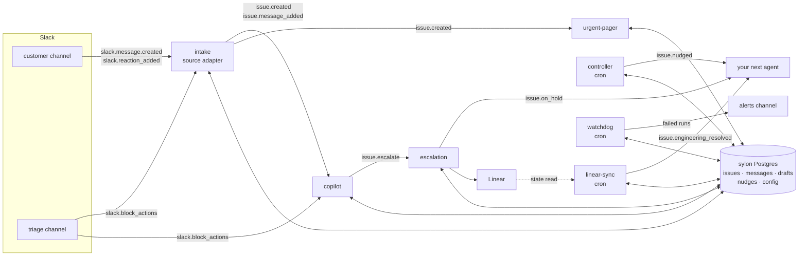

# Sylon

A Slack support desk you can clone, built from a fleet of Sapiom agents.

Pylon quoted us about \$3 a ticket, with a 500-ticket monthly minimum. The core of what a B2B
support tool does is small: turn customer Slack messages into issues, triage them, draft replies,
escalate bugs to Linear, and follow up on what has stalled. We didn't want to pay \$1,500 a month
for that, so we built Sylon on Sapiom. Clone it for free and pay only for your own agent runs.

What it does:

- A customer message in a Slack channel becomes an issue, classified by Jev (bug, question,
  billing, ...; urgent to low), linked to the customer's account, and posted as a card in your
  desk's triage channel.
- A copilot drafts a reply grounded in the public docs and your team's own knowledge base (see Knowledge). A teammate clicks **Approve**
  to send it to the customer, **Escalate** to open a Linear issue, or **Dismiss**.
- A controller nudges the triage thread when an issue has no draft, a draft waits for a decision,
  a customer waits for a reply, or nobody owns the issue.
- A thank-you or an acknowledgement opens nothing.
- One deployed fleet serves several isolated **desks** (say `test` and `support`): each has its own
  triage channel, board, Linear project, on-call user, nudge timing and, if you want, knowledge
  base. See Desks.

## Architecture

The agents never call each other. Source adapters turn raw events into domain events; domain agents
start from those events, read and write one shared Postgres, and emit more domain events. Adding an
agent means deploying it and attaching a trigger. No other agent changes.



| Layer         | What lives there                                                                                                                                                                        |
| ------------- | --------------------------------------------------------------------------------------------------------------------------------------------------------------------------------------- |
| Adapters      | `intake` reads `slack.*` and is the only agent that knows Slack message shapes. A later adapter (Read.ai, email) emits the same `issue.*`.                                              |
| Domain events | `issue.created`, `issue.message_added`, `issue.escalate`, `issue.on_hold`, `issue.nudged`, `issue.engineering_resolved` (`_shared/events.ts`). Every payload carries `issueId`, `accountId`, `source`, `causationId`. |
| Domain agents | copilot, escalation, controller, linear-sync, urgent-pager: they consume `issue.*` and the `slack.block_actions` for their own button prefix only.                                                   |
| Shared state  | One Postgres (`sylon`), written only through `_shared/issues.ts`; desks (`_shared/desks.ts`) and runtime config in its `desks` and `config` tables.                                    |

## Agents

| Agent                 | Trigger                                                                | Does                                                                                                                                                                     |
| --------------------- | ---------------------------------------------------------------------- | ------------------------------------------------------------------------------------------------------------------------------------------------------------------------ |
| `intake`              | `slack.message.created`, `slack.reaction_added`, `slack.block_actions` | Classifies a customer message with Jev, opens an issue or links it to an open one, posts the triage card, emits `issue.*`. Owns Take and Close, and 🎫 (force an issue). |
| `copilot`             | `issue.created`, `issue.message_added`, `slack.block_actions`          | Drafts a reply from the docs and the team's articles, posts a draft card. Approve sends it, Escalate emits `issue.escalate`, Dismiss drops it.                           |
| `escalation`          | `issue.escalate`                                                       | Opens one Linear issue, replies "Tracked as SAP-n" in both threads, moves the issue On Hold.                                                                             |
| `controller`          | cron, every 2 minutes                                                  | Nudges stalled issues in their triage thread, once per issue and reason.                                                                                                 |
| `linear-sync`         | cron, every 2 minutes                                                  | Reads the Linear state of On Hold issues (25 per run, least recently checked first). Done or Canceled: posts in the triage thread and moves the issue to On You; Done also emits `issue.engineering_resolved`. |
| `watchdog`            | cron, every 5 minutes                                                  | Polls the Sapiom API for failed runs of the other Sylon agents and posts one Slack message per failure: agent, step, error, link and action items.                       |
| `urgent-pager` (opt.) | `issue.created`                                                        | DMs the on-call user when an issue is urgent. The live-added agent; see below.                                                                                           |

### linear-sync and customer messages

`linear-sync` always posts in the triage thread. It posts in the customer thread ("Our engineering
team has shipped a fix for this. ...") only when the config key `linear_sync.notify_customer` is
`true`. It is `false` in `fleet.json`, so a shadow install shows customers nothing. Turn it on with
`setConfig(db, "linear_sync.notify_customer", true, "you")` or by editing the `config` row; a
database seeded before this key existed behaves as `false`.

## Quickstart

Prerequisites in your Sapiom org:

- A **Slack** connector, with the bot invited to the triage channel and to any customer channel. The invite is the control: the bot only sees channels it is in, and a message from anyone outside your Slack workspace in one of them is a customer's. No per-channel config is needed.
- A **Linear** connector with write access, discovered under the MCP relay slug `linear`.
- An org API key in `SAPIOM_API_KEY`.

```bash
pnpm install --ignore-workspace   # this directory is outside the sapiom-js workspace
pnpm test && pnpm typecheck       # vitest; pg-mem stands in for Postgres, no network
```

`fleet.json` holds example ids (`C0CUSTOMER1`, `C0TRIAGE001`, `example-linear-team-id`, ...). Put
your workspace's ids in `fleet.local.json` (gitignored). `config` keys you leave out keep the
`fleet.json` value; a local `desks` list replaces fleet.json's whole. Setup stops if a Slack or
Linear id is still an example:

```json
{
  "desks": [
    {
      "slug": "test",
      "name": "Test",
      "triageChannel": "<test triage channel id>",
      "linearTeamId": "<Linear team id or key>",
      "linearProjectId": "<Linear project id for test tickets>",
      "oncallSlackId": "<Slack user id>",
      "nudgeMinutes": 5,
      "default": true
    },
    {
      "slug": "support",
      "name": "Support",
      "triageChannel": "<support triage channel id>",
      "linearTeamId": "<Linear team id or key>",
      "linearProjectId": "<Linear project id for real tickets>",
      "oncallSlackId": "<Slack user id>",
      "nudgeMinutes": 30
    }
  ],
  "config": {
    "channels.customer": [
      {
        "channelId": "<test customer channel>",
        "accountName": "Test Customer",
        "desk": "test"
      },
      {
        "channelId": "<real customer channel>",
        "accountName": "Acme",
        "desk": "support"
      }
    ]
  }
}
```

A single-desk install lists one desk. `channels.customer` is optional and names accounts and their
desk: a listed channel gets its account at setup under the given name and desk, any other channel
gets one on the first outside message, named by its channel id and filed under the default desk.
Leave the example entry out (`[]`) or setup stops. Other optional keys are read with a default when
unset (so a live fleet needs no re-seed):

| Key                       | Default                                     | Effect                                                                                                                                                                                                 |
| ------------------------- | ------------------------------------------- | ------------------------------------------------------------------------------------------------------------------------------------------------------------------------------------------------------ |
| `team.slack_team_ids`     | the workspace the connector is installed in | Slack workspace ids whose members are our team. A customer-channel message from one of them is a team message: stored, never opened as an issue; a reply in an issue's thread moves it to On Customer. |
| `customers.test_user_ids` | `[]`                                        | Slack user ids always treated as the customer, even from our workspace. Lets one person test with two accounts in the same workspace.                                                                  |
| `intake.reactions`        | `true`                                      | `false` stops intake adding or removing 👀 and 🎫 on customer messages, so a shadow pilot leaves no visible footprint.                                                                                 |

## Desks

A desk is the unit that keeps test traffic and real traffic apart while they share agents and code.
It owns a triage channel, a Linear team and project, an on-call user and the nudge threshold; its
accounts and issues belong to it, and each knowledge article belongs to one desk or to all of them.

| Desk field                        | Used by                                                                       |
| --------------------------------- | ----------------------------------------------------------------------------- |
| `triageChannel`                   | cards, drafts, notes and nudges for the desk's issues; where its clicks count |
| `linearTeamId`, `linearProjectId` | escalation (falls back to the old `linear.*` config keys when unset)          |
| `oncallSlackId`                   | urgent-pager (falls back to the old `oncall.slack_id` key)                    |
| `nudgeMinutes` (default 30)       | controller                                                                    |
| `default`                         | the desk for any customer channel `channels.customer` does not assign         |

How a message finds its desk: intake looks up the customer channel in `channels.customer`; its
`desk` slug names the desk, and an entry without one (or an unlisted channel) gets the default desk.
The account keeps that desk, and every issue it opens does too. A channel naming an unknown desk,
or any channel when no default desk exists, is skipped with the outcome `no desk for channel`;
nothing is filed. A Take, Close or triage-thread message counts only from the triage channel of the
issue's desk, so a click in the `test` triage channel cannot touch a `support` issue. The watchdog
is fleet-wide: it alerts in `alerts.channel`, else the default desk's triage channel.

Add or change a desk by editing `desks` in `fleet.local.json` and running `pnpm run setup`
(`--overwrite` updates a desk that exists). A database installed before desks gets a default desk
`test` from its existing `channels.triage`, `linear.*`, `oncall.slack_id` and `nudge.minutes`
config rows in migration 080, and every existing account and issue is filed under it. Those config
keys stay readable as fallbacks and are no longer required. Moving a desk's triage channel strands
its existing cards, which stay in the old channel.

Then install the fleet:

```bash
SAPIOM_API_KEY=<org key> pnpm run setup   # pnpm run, not `pnpm setup` (pnpm's own command)
```

`setup.ts` reads `fleet.json` and runs each step as check-then-create, so a second run prints
`no changes: the fleet is installed`:

1. Probes the Slack and Linear connectors, and stops with what to connect if one is missing.
2. Resolves or creates the `sylon` database, applies migrations, seeds missing desks, config and accounts.
3. Adds three starter policy articles when the knowledge base is empty.
4. Links and deploys each project, skipping one whose bundle is already the live build.
5. Lists each agent's triggers and attaches only the missing ones. The server dedups event
   triggers but not cron.
6. Writes `.sapiom/fleet-state.json`: definition, build and trigger ids, with no keys.

`--skip <key>` leaves a project out, and `--only <key>` acts on exactly the named projects,
including optional ones. `--no-triggers` deploys without attaching triggers. `--overwrite` resets desks and config to `fleet.local.json` + `fleet.json`
(normally a rerun keeps what an onboarding flow changed).

### Failure alerts (watchdog)

No event fires when a run fails, so the watchdog polls `GET /v1/workflows/executions?status=failed`
for every Sylon agent (itself and the smoke agents excluded) and posts one message per new failure.
The first run looks back one hour; later runs start 30 minutes before the last successful poll, and
`watchdog_reported` keeps each execution from being announced twice. More than 10 failures in one
tick post 10 and one "and N more" line linking the Events page.

- **Channel.** `alerts.channel` in `fleet.local.json` (or the `config` table). When unset, alerts go to
  the default desk's triage channel.
- **Credential.** That route needs `org.read`, which the per-run key behind `ctx.sapiom` does not
  hold. `pnpm run setup` provisions it: it mints a child key with only `org.read` and stores it as
  the watchdog's secret `SYLON_WATCHDOG_API_KEY`, which Sapiom injects into the agent as an
  environment variable. A rerun finds the secret and does nothing. The key running setup needs
  `org.api_keys.write` and `org.write`; without them setup stops and tells you to create an
  `org.read` key yourself and add it in the agent's Secrets tab. The key is never printed or
  written to `.sapiom/fleet-state.json` (only its id).

Demo helpers: `pnpm run replay` posts the scripted conversation in `scripts/replay.json` and prints
each receipt, run, issue and draft card as it appears. `pnpm run reset-demo` closes every open
issue. See `docs/DEMO.md`.

## Knowledge

The copilot drafts from two sources, and neither is compiled into the agent.

- **Public docs, fetched live.** Each draft starts with one small model call that reads the issue,
  the customer's latest messages and the index at `https://docs.sapiom.ai/llms.txt`, and picks up to
  three pages. Those pages are fetched as markdown (`<page url>.md`), cut to 12,000 characters each,
  and cached in the `doc_cache` table for one hour. Only URLs under `https://docs.sapiom.ai/` are
  ever fetched. If the docs cannot be read, the draft is written from the team's articles alone and
  its confidence is capped at 50%; if only some selected pages fail, the prompt names them and
  confidence is capped at 60%. The run does not fail.
- **Team knowledge, edited in the Console.** The **Knowledge** tab lists the `kb_articles` table:
  create, edit, enable or disable, and delete. A _policy_ is a rule the copilot always follows
  (refund wording, SLAs, tone). An _answer_ is a team-written Q&A; they are all included while
  their text totals under 15,000 characters, and chosen by the same selection call beyond that.
  Edits apply to the next draft with no redeploy. An article is for one desk or for all desks
  (`desk_id` null); a draft reads its issue's desk articles plus the all-desks ones. Setup's starter
  policies are for all desks.

Citations on a draft card are the docs pages (as links) and the team articles the reply used.

Seeding: `pnpm run setup` adds three starter policies (billing questions beyond the pricing page,
never ask for credentials, tone) when the table is empty. They are examples; edit or delete them in
the Console. To load more at once, insert rows into `kb_articles` with `kind` `policy` or `answer`.

## Console

The Console is an App Link (`sylon-console`) for operating the demo: fleet switches, the controller, the board, a latency timeline, metrics, failed events with replay, and cue cards. A desk switcher in the header (`?desk=<slug>`, default desk preselected) scopes the board, timeline, metrics, failed events and Knowledge tab to one desk; Reset board closes only that desk's open tickets. Dispatch timing in the metrics is fleet-wide, and a failed event that carries no issue (a raw Slack event) shows on every desk. The System tab lists the desks with their triage channel and Linear project. Its state lives in the `sylon` database and the Sapiom API.

```bash
pnpm run console:build     # bundle apps/console into apps/console/dist/server.mjs
pnpm run console:publish   # build, then create or update the org-only App Link and publish it
```

`console:publish` reads `SAPIOM_API_KEY` from your shell, which must be an org key with write access (the Console changes triggers, starts runs, replays receipts and redraws Slack cards). The key is stored in the link's env as `SYLON_CONSOLE_API_KEY`; the platform's own read-only `SAPIOM_API_KEY` cannot write. The link is organization-only and publish refuses any other visibility. To republish after a change, run `pnpm run console:publish` again; it updates the same link.

## Add your own agent

`agents/urgent-pager` is the worked example: about 40 lines that page on-call for urgent issues,
added to a running fleet with one deploy and one trigger.

1. **Pick the event.** Start from a domain event, never a raw `slack.*` one (except clicks on
   your own button prefix). urgent-pager reads `issue.created`, whose payload has `priority` and
   `title`.
2. **Write the agent.** Copy `agents/urgent-pager/` (an `index.ts` and a `package.json`). Declare
   the payload schema from `_shared/events.ts` as the entry `inputSchema`, read config with
   `getConfig`, and post through `_shared/slack.ts`:

   ```ts
   const page = defineStep({
     name: "page",
     terminal: true,
     inputSchema: Events["issue.created"],
     async run(input, ctx) {
       if (input.priority !== "urgent")
         return terminate({ outcome: "not_urgent" });
       return withDb(ctx, async (db) => {
         if (await messageBySourceEventId(db, pageKey(input.issueId)))
           return terminate({ outcome: "already_paged" }); // a retried run pages once
         const desk = await deskForIssue(db, await getIssue(db, input.issueId));
         const oncall = await oncallFor(db, desk);
         const dm = await post(ctx, {
           channel: oncall!,
           text: `Urgent: ${input.title}`,
         });
         await linkMessage(db, {
           sourceEventId: pageKey(input.issueId) /* ... */,
         });
         return terminate({ outcome: "paged", ts: dm.ts });
       });
     },
   });
   ```

   A step re-runs from the top on retry, so key every write on something natural (here
   `urgent-pager:<issueId>` in `messages`).

3. **Test it offline.** Put fixtures in `fixtures/<agent>/` (`{ type, description, payload }`);
   `_shared/events.test.ts` validates every fixture against its schema. Unit-test the step with
   `fakeCtx({ isLocalTrace: true })`, which stubs Slack and gives the run an in-memory database.
4. **Register it in `fleet.json`**: a project (`"optional": true` if a default install should
   leave it out) and its triggers.
5. **Ship it:** `pnpm run setup --only urgent-pager`. In our own workspace this created, deployed
   and armed the agent in 37 seconds, and the next urgent message DMed on-call.

A new source works the same way: an adapter (say, a Read.ai meeting adapter) emits the existing
`issue.*` events with a new `source`, and every domain agent picks it up unchanged.

## Layout

```
fleet.json            projects, triggers, connectors, example config values
fleet.local.json      your workspace's ids (gitignored; you create it)
setup.ts              pnpm run setup: the installer (preflight, db, starter articles, deploy, triggers, state)
_shared/              inlined into every agent by the bundler (relative imports, zod/v4)
  events.ts           raw slack.* and domain issue.* schemas
  db.ts               Db interface, withDb(ctx, fn), migrations runner, pg-mem for local runs
  migrations/         *.sql (+ index.ts mirror; the bundler has no .sql loader)
  issues.ts           the only writer of the tables; status machine
  config.ts seed.ts   typed runtime config in the config table; seed.ts also seeds desks
  desks.ts            the only reader/writer of desks (triage channel, Linear target, on-call, nudge)
  slack.ts linear.ts  Slack connector methods; Linear MCP relay
  emit.ts blocks.ts   events.emit + events_log; Block Kit cards and the button codec
  kb.ts docs.ts       the team's knowledge articles; live docs.sapiom.ai pages with a db cache
agents/<key>/         one deployable project each (index.ts, package.json, gitignored sapiom.json)
fixtures/<dir>/       { type, description, payload } per event; payload is the run input
scripts/              fleet (setup's pure logic), replay, reset-demo
docs/DEMO.md          rehearsal checklist and failure drill
```

`run_local` gives each execution its own in-memory database seeded from `fleet.json`, so two agents
run locally one after another do not share issues. To follow one issue through several agents
offline, use a vitest test with one shared database (`setLocalDb`, as in `agents/smoke.test.ts`).
The deployed agents always share the `sylon` database.

## Known limitations

| Limitation                                                                                                                                                                                                                                                                                                                                                                                                                                                                                                                                                                                                                                                            | Why                                                                                                                     |
| --------------------------------------------------------------------------------------------------------------------------------------------------------------------------------------------------------------------------------------------------------------------------------------------------------------------------------------------------------------------------------------------------------------------------------------------------------------------------------------------------------------------------------------------------------------------------------------------------------------------------------------------------------------------- | ----------------------------------------------------------------------------------------------------------------------- |
| **Post, then record.** If Slack accepts a post and the next database write fails, a retry posts again (a duplicate card or reply).                                                                                                                                                                                                                                                                                                                                                                                                                                                                                                                                    | Slack's Web API has no idempotency key. The window is the gap between Slack's 200 and the next write.                   |
| **Linear adoption window.** A retry more than 7 days after a crash between creating the Linear issue and recording it creates a second one.                                                                                                                                                                                                                                                                                                                                                                                                                                                                                                                           | `save_issue` has no idempotency key; escalation adopts by a `sylon:<issueId>` marker over the last 7 days.              |
| **A desk's triage channel is looked up, not stored per issue.** Changing a desk's `triageChannel` strands that desk's existing cards. | Persisting the channel on the issue is left for an onboarding flow. |
| **Intake links by content.** A new top-level message joins any open issue Jev judges to be the same problem (p ≥ 0.8). Leftover open issues capture new messages.                                                                                                                                                                                                                                                                                                                                                                                                                                                                                                     | Run `pnpm run reset-demo` before a demo.                                                                                |
| **Latency.** Customer post to triage card takes 25–36 s; issue card to draft card about 20 s.                                                                                                                                                                                                                                                                                                                                                                                                                                                                                                                                                                         | Each event waits up to about 15 s for the engine's dispatch cycle, and intake makes a Jev call and several Slack calls. |
| **Deploy detection is local.** setup skips a deploy when the bundle hash in `.sapiom/fleet-state.json` matches the live build; a fresh clone redeploys once.                                                                                                                                                                                                                                                                                                                                                                                                                                                                                                          | The server does not expose a content hash for a build.                                                                  |
| **One Linear team; customers are recognised by Slack workspace.** Anyone outside `team.slack_team_ids` (default: the connector's own workspace) posting in a channel the bot is in is a customer, and the channel gets an account. The connector has no `conversations.info`, so shared channels cannot be detected. A team member's message is kept only in a channel that already has an account; elsewhere it is skipped and nothing is stored. A customer who posts from your workspace needs `customers.test_user_ids`. A team reply moves the issue to On Customer and supersedes pending drafts without redrawing their cards. No SLAs, email intake or board. | Out of scope for this example.                                                                                          |

