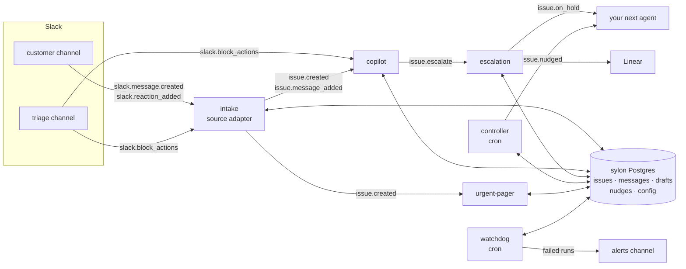

# Sylon

A Slack support desk you can clone, built from a fleet of Sapiom agents.

Pylon quoted us about \$3 a ticket, with a 500-ticket monthly minimum. The core of what a B2B
support tool does is small: turn customer Slack messages into issues, triage them, draft replies,
escalate bugs to Linear, and follow up on what has stalled. We didn't want to pay \$1,500 a month
for that, so we built Sylon on Sapiom. Clone it for free and pay only for your own agent runs.

What it does:

- A customer message in a Slack channel becomes an issue, classified by Jev (bug, question,
  billing, ...; urgent to low), linked to the customer's account, and posted as a card in your
  triage channel.
- A copilot drafts a reply grounded in your knowledge base (`kb/`). A teammate clicks **Approve**
  to send it to the customer, **Escalate** to open a Linear issue, or **Dismiss**.
- A controller nudges the triage thread when an issue has no draft, a draft waits for a decision,
  a customer waits for a reply, or nobody owns the issue.
- A thank-you or an acknowledgement opens nothing.

## Architecture

The agents never call each other. Source adapters turn raw events into domain events; domain agents
start from those events, read and write one shared Postgres, and emit more domain events. Adding an
agent means deploying it and attaching a trigger. No other agent changes.



| Layer         | What lives there                                                                                                                                                                        |
| ------------- | --------------------------------------------------------------------------------------------------------------------------------------------------------------------------------------- |
| Adapters      | `intake` reads `slack.*` and is the only agent that knows Slack message shapes. A later adapter (Read.ai, email) emits the same `issue.*`.                                              |
| Domain events | `issue.created`, `issue.message_added`, `issue.escalate`, `issue.on_hold`, `issue.nudged` (`_shared/events.ts`). Every payload carries `issueId`, `accountId`, `source`, `causationId`. |
| Domain agents | copilot, escalation, controller, urgent-pager: they consume `issue.*` and the `slack.block_actions` for their own button prefix only.                                                   |
| Shared state  | One Postgres (`sylon`), written only through `_shared/issues.ts`; runtime config in its `config` table.                                                                                 |

## Agents

| Agent                 | Trigger                                                                | Does                                                                                                                                                                     |
| --------------------- | ---------------------------------------------------------------------- | ------------------------------------------------------------------------------------------------------------------------------------------------------------------------ |
| `intake`              | `slack.message.created`, `slack.reaction_added`, `slack.block_actions` | Classifies a customer message with Jev, opens an issue or links it to an open one, posts the triage card, emits `issue.*`. Owns Take and Close, and 🎫 (force an issue). |
| `copilot`             | `issue.created`, `issue.message_added`, `slack.block_actions`          | Drafts a reply from `kb/`, posts a draft card. Approve sends it, Escalate emits `issue.escalate`, Dismiss drops it.                                                      |
| `escalation`          | `issue.escalate`                                                       | Opens one Linear issue, replies "Tracked as SAP-n" in both threads, moves the issue On Hold.                                                                             |
| `controller`          | cron, every 2 minutes                                                  | Nudges stalled issues in their triage thread, once per issue and reason.                                                                                                 |
| `watchdog`            | cron, every 5 minutes                                                  | Polls the Sapiom API for failed runs of the other Sylon agents and posts one Slack message per failure: agent, step, error, link and action items.                       |
| `urgent-pager` (opt.) | `issue.created`                                                        | DMs the on-call user when an issue is urgent. The live-added agent; see below.                                                                                           |

## Quickstart

Prerequisites in your Sapiom org:

- A **Slack** connector, with the bot invited to your customer and triage channels.
- A **Linear** connector with write access, discovered under the MCP relay slug `linear`.
- An org API key in `SAPIOM_API_KEY`.

```bash
pnpm install --ignore-workspace   # this directory is outside the sapiom-js workspace
pnpm test && pnpm typecheck       # vitest; pg-mem stands in for Postgres, no network
```

`fleet.json` holds example ids (`C0CUSTOMER1`, `example-linear-team-id`, ...). Put your workspace's
ids in `fleet.local.json` (gitignored). Any key you leave out keeps the `fleet.json` value, and
setup stops if a Slack or Linear id is still an example:

```json
{
  "config": {
    "linear.team_id": "<Linear team id or key>",
    "linear.project_id": "<Linear project id>",
    "channels.triage": "<triage channel id>",
    "channels.customer": [
      { "channelId": "<customer channel id>", "accountName": "Acme" }
    ],
    "oncall.slack_id": "<Slack user id>"
  }
}
```

Then install the fleet:

```bash
SAPIOM_API_KEY=<org key> pnpm run setup   # pnpm run, not `pnpm setup` (pnpm's own command)
```

`setup.ts` reads `fleet.json` and runs each step as check-then-create, so a second run prints
`no changes: the fleet is installed`:

1. Probes the Slack and Linear connectors, and stops with what to connect if one is missing.
2. Resolves or creates the `sylon` database, applies migrations, seeds missing config and accounts.
3. Rebuilds `_shared/kb.generated.ts` if `kb/` changed.
4. Links and deploys each project, skipping one whose bundle is already the live build.
5. Lists each agent's triggers and attaches only the missing ones. The server dedups event
   triggers but not cron.
6. Writes `.sapiom/fleet-state.json`: definition, build and trigger ids, with no keys.

`--skip <key>` leaves a project out, and `--only <key>` acts on exactly the named projects,
including optional ones. `--no-triggers` deploys without attaching triggers. `--overwrite` resets config to `fleet.local.json` + `fleet.json`
(normally a rerun keeps config that an onboarding flow changed).

### Failure alerts (watchdog)

No event fires when a run fails, so the watchdog polls `GET /v1/workflows/executions?status=failed`
for every Sylon agent (itself and the smoke agents excluded) and posts one message per new failure.
The first run looks back one hour; later runs start 30 minutes before the last successful poll, and
`watchdog_reported` keeps each execution from being announced twice. More than 10 failures in one
tick post 10 and one "and N more" line linking the Events page.

- **Channel.** `alerts.channel` in `fleet.local.json` (or the `config` table). When unset, alerts go to
  `channels.triage`.
- **Credential.** That route needs `org.read`, which the per-run key behind `ctx.sapiom` does not
  hold. `pnpm run setup` provisions it: it mints a child key with only `org.read` and stores it as
  the watchdog's secret `SYLON_WATCHDOG_API_KEY`, which Sapiom injects into the agent as an
  environment variable. A rerun finds the secret and does nothing. The key running setup needs
  `org.api_keys.write` and `org.write`; without them setup stops and tells you to create an
  `org.read` key yourself and add it in the agent's Secrets tab. The key is never printed or
  written to `.sapiom/fleet-state.json` (only its id).

Demo helpers: `pnpm run replay` posts the scripted conversation in `scripts/replay.json` and prints
each receipt, run, issue and draft card as it appears. `pnpm run reset-demo` closes every open
issue. See `docs/DEMO.md`.

## Add your own agent

`agents/urgent-pager` is the worked example: about 40 lines that page on-call for urgent issues,
added to a running fleet with one deploy and one trigger.

1. **Pick the event.** Start from a domain event, never a raw `slack.*` one (except clicks on
   your own button prefix). urgent-pager reads `issue.created`, whose payload has `priority` and
   `title`.
2. **Write the agent.** Copy `agents/urgent-pager/` (an `index.ts` and a `package.json`). Declare
   the payload schema from `_shared/events.ts` as the entry `inputSchema`, read config with
   `getConfig`, and post through `_shared/slack.ts`:

   ```ts
   const page = defineStep({
     name: "page",
     terminal: true,
     inputSchema: Events["issue.created"],
     async run(input, ctx) {
       if (input.priority !== "urgent")
         return terminate({ outcome: "not_urgent" });
       return withDb(ctx, async (db) => {
         if (await messageBySourceEventId(db, pageKey(input.issueId)))
           return terminate({ outcome: "already_paged" }); // a retried run pages once
         const oncall = await getConfig(db, "oncall.slack_id");
         const dm = await post(ctx, {
           channel: oncall,
           text: `Urgent: ${input.title}`,
         });
         await linkMessage(db, {
           sourceEventId: pageKey(input.issueId) /* ... */,
         });
         return terminate({ outcome: "paged", ts: dm.ts });
       });
     },
   });
   ```

   A step re-runs from the top on retry, so key every write on something natural (here
   `urgent-pager:<issueId>` in `messages`).

3. **Test it offline.** Put fixtures in `fixtures/<agent>/` (`{ type, description, payload }`);
   `_shared/events.test.ts` validates every fixture against its schema. Unit-test the step with
   `fakeCtx({ isLocalTrace: true })`, which stubs Slack and gives the run an in-memory database.
4. **Register it in `fleet.json`**: a project (`"optional": true` if a default install should
   leave it out) and its triggers.
5. **Ship it:** `pnpm run setup --only urgent-pager`. On Sapiom Internal this created, deployed
   and armed the agent in 37 seconds, and the next urgent message DMed on-call.

A new source works the same way: an adapter (say, a Read.ai meeting adapter) emits the existing
`issue.*` events with a new `source`, and every domain agent picks it up unchanged.

## Layout

```
fleet.json            projects, triggers, connectors, example config values
fleet.local.json      your workspace's ids (gitignored; you create it)
setup.ts              pnpm run setup: the installer (preflight, db, kb, deploy, triggers, state)
_shared/              inlined into every agent by the bundler (relative imports, zod/v4)
  events.ts           raw slack.* and domain issue.* schemas
  db.ts               Db interface, withDb(ctx, fn), migrations runner, pg-mem for local runs
  migrations/         *.sql (+ index.ts mirror; the bundler has no .sql loader)
  issues.ts           the only writer of the tables; status machine
  config.ts seed.ts   typed runtime config in the config table
  slack.ts linear.ts  Slack connector methods; Linear MCP relay
  emit.ts blocks.ts   events.emit + events_log; Block Kit cards and the button codec
  kb.generated.ts     kb/*.md compiled for the copilot (pnpm run build:kb; committed)
agents/<key>/         one deployable project each (index.ts, package.json, gitignored sapiom.json)
kb/                   the copilot's knowledge base, one markdown page per topic
fixtures/<dir>/       { type, description, payload } per event; payload is the run input
scripts/              build-kb, fleet (setup's pure logic), replay, reset-demo
docs/DEMO.md          rehearsal checklist and failure drill
```

`run_local` gives each execution its own in-memory database seeded from `fleet.json`, so two agents
run locally one after another do not share issues. To follow one issue through several agents
offline, use a vitest test with one shared database (`setLocalDb`, as in `agents/smoke.test.ts`).
The deployed agents always share the `sylon` database.

## Known limitations

| Limitation                                                                                                                                                        | Why                                                                                                                     |
| ----------------------------------------------------------------------------------------------------------------------------------------------------------------- | ----------------------------------------------------------------------------------------------------------------------- |
| **Post, then record.** If Slack accepts a post and the next database write fails, a retry posts again (a duplicate card or reply).                                | Slack's Web API has no idempotency key. The window is the gap between Slack's 200 and the next write.                   |
| **Linear adoption window.** A retry more than 7 days after a crash between creating the Linear issue and recording it creates a second one.                       | `save_issue` has no idempotency key; escalation adopts by a `sylon:<issueId>` marker over the last 7 days.              |
| **Triage channel is not stored per issue.** Changing `channels.triage` on a live fleet strands existing cards.                                                    | Persisting it is a schema change left for an onboarding flow.                                                           |
| **Intake links by content.** A new top-level message joins any open issue Jev judges to be the same problem (p ≥ 0.8). Leftover open issues capture new messages. | Run `pnpm run reset-demo` before a demo.                                                                                |
| **Latency.** Customer post to triage card takes 25–36 s; issue card to draft card about 20 s.                                                                     | Each event waits up to about 15 s for the engine's dispatch cycle, and intake makes a Jev call and several Slack calls. |
| **Deploy detection is local.** setup skips a deploy when the bundle hash in `.sapiom/fleet-state.json` matches the live build; a fresh clone redeploys once.      | The server does not expose a content hash for a build.                                                                  |
| **One Slack workspace, one Linear team.** No Slack Connect hardening, SLAs, email intake or board.                                                                | Out of scope for this example.                                                                                          |

The contract the agents build against is `plans/sylon/interfaces.md` in the Sapiom monorepo.
